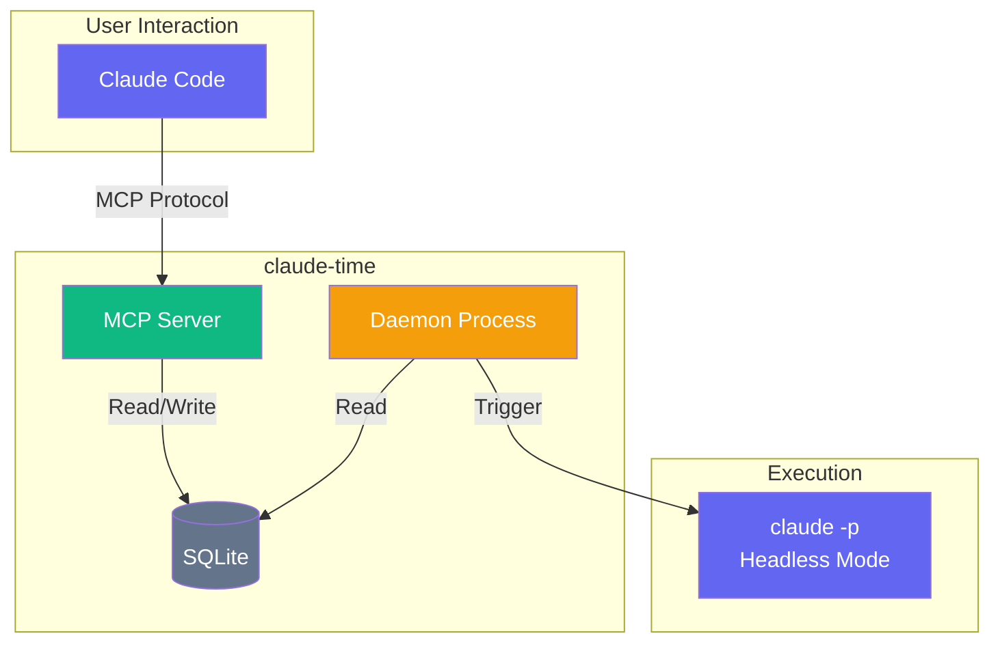

# claude-time

A universal scheduler MCP server for Claude Code.

Schedule tasks using natural language and let Claude Code execute them automatically in headless mode.

## Features

- Natural language scheduling ("every day at 9:00", "every 5 minutes", etc.)
- Japanese language support ("毎日9時", "5分ごと", etc.)
- Direct cron expressions also supported
- Task execution via Claude Code Headless Mode (`claude -p`)
- SQLite persistence for schedules and logs
- Background daemon for automatic execution

## Architecture



## Installation

```bash
git clone https://github.com/owl-tech-sui/claude-time.git
cd claude-time
npm install
npm run build
```

## Register with Claude Code

```bash
claude mcp add claude-time -t stdio -- node /path/to/claude-time/dist/index.js
```

Or manually edit `~/.claude.json`:

```json
{
  "mcpServers": {
    "claude-time": {
      "type": "stdio",
      "command": "node",
      "args": ["/path/to/claude-time/dist/index.js"]
    }
  }
}
```

## Usage

### Schedule Management in Claude Code

```
$ claude
> Add a schedule to check git status every day at 9:00

Claude: Schedule added successfully!
  - Name: git status check
  - Cron: 0 9 * * *
  - Next run: Tomorrow 09:00
```

### Supported Natural Language Patterns

| Input | Cron Expression |
|-------|-----------------|
| `every 5 minutes` | `*/5 * * * *` |
| `every hour` | `0 * * * *` |
| `every day at 9:00` | `0 9 * * *` |
| `daily at 21:30` | `30 21 * * *` |
| `every monday at 10:00` | `0 10 * * 1` |
| `weekdays at 9:00` | `0 9 * * 1-5` |
| `weekend at 18:00` | `0 18 * * 0,6` |

Japanese patterns are also supported:

| Input | Cron Expression |
|-------|-----------------|
| `5分ごと` | `*/5 * * * *` |
| `毎日9時` | `0 9 * * *` |
| `毎週月曜9時` | `0 9 * * 1` |
| `平日9時` | `0 9 * * 1-5` |

### MCP Tools

| Tool | Description |
|------|-------------|
| `schedule_add` | Add a new schedule |
| `schedule_list` | List all schedules |
| `schedule_remove` | Remove a schedule |
| `schedule_pause` | Pause a schedule |
| `schedule_resume` | Resume a paused schedule |
| `schedule_logs` | View execution logs |

### Daemon Management

The daemon must be running to execute scheduled tasks.

```bash
# Start daemon
node dist/daemon.js start

# Check status
node dist/daemon.js status

# Stop daemon
node dist/daemon.js stop
```

### CLI Commands

```bash
# List all schedules
node dist/cli.js list

# View execution logs
node dist/cli.js logs

# View logs for specific schedule
node dist/cli.js logs "schedule-name" -n 20
```

## Configuration

### Timezone

By default, claude-time uses your system's timezone. You can override it with environment variables:

```bash
# Option 1: Use CLAUDE_TIME_TZ
export CLAUDE_TIME_TZ="America/New_York"

# Option 2: Use standard TZ variable
export TZ="Europe/London"
```

Priority order:
1. `CLAUDE_TIME_TZ` environment variable
2. `TZ` environment variable
3. System default timezone

### Locale

Display format can be customized:

```bash
export CLAUDE_TIME_LOCALE="en-US"
```

## Data Storage

Schedules and execution logs are stored in `data/claude-time.db` (SQLite).

## Tech Stack

- **Language**: TypeScript
- **MCP SDK**: @modelcontextprotocol/sdk
- **Scheduler**: node-cron
- **Storage**: better-sqlite3

## License

MIT
