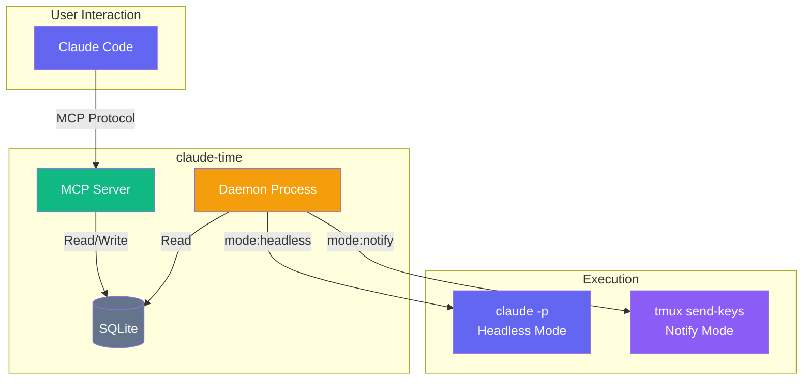

# claude-time

A universal scheduler MCP server for Claude Code.

Schedule tasks using natural language and let Claude Code execute them automatically in headless mode or notify your existing Claude session.

## Features

- **Natural language scheduling** ("every day at 9:00", "every 5 minutes", etc.)
- **Japanese language support** ("毎日9時", "5分ごと", "毎月1日10時", etc.)
- **Formatted patterns** (`daily@09:00`, `weekly@mon@10:00`, `monthly@1@09:00`, etc.)
- **Simple time input** ("11:09", "9時" → daily at that time)
- **One-time schedules** ("5分後", "明日9時", "in 30 minutes", "tomorrow at 9:00")
- **Direct cron expressions** also supported
- **Two execution modes**: headless (claude -p) or notify (tmux message)
- **tmux integration** (v0.3.0+): Safe notifications to existing Claude sessions
- **Daemon control via MCP** (start/stop/status from Claude Code)
- **macOS auto-start** (launchd integration)
- **Notifications** (macOS native notifications on completion/failure)
- **SQLite persistence** for schedules and logs

## Architecture



### Execution Modes

| Mode | Description | Use Case |
|------|-------------|----------|
| `headless` (default) | Runs `claude -p` in a new process | Standalone automation, no context needed |
| `notify` | Sends message to existing tmux session | Reminders to existing Claude session, context-aware tasks |

**Why notify mode?**

When `claude -p` runs, it starts a **new Claude instance without any context**. This can cause problems:
- Duplicate actions (e.g., replying to already-handled mentions)
- No memory of previous conversations
- No access to project-specific context

Notify mode solves this by sending a message to your **existing** Claude session in tmux, which has full context.

## Quick Start

### Option A: tmux Integration (Recommended for notify mode)

```bash
# 1. Clone and build
git clone https://github.com/owl-tech-sui/claude-time.git
cd claude-time
npm install
npm run build

# 2. Register with Claude Code
claude mcp add claude-time -t stdio -- node $(pwd)/dist/index.js

# 3. Install CLI globally (optional but recommended)
npm link

# 4. Start with tmux integration
claude-time start
# Or without npm link: node dist/cli.js start
# This creates a tmux session with:
# - Pane 0: Daemon
# - Pane 1: Your Claude session

# 4. In the Claude pane, run `claude` and add schedules with notify mode
claude
> Add a schedule named "X check" at 21:00 with mode "notify" and prompt "Time to check X mentions!"
```

### Option B: Headless Mode (Traditional)

```bash
# 1. Clone and build
git clone https://github.com/owl-tech-sui/claude-time.git
cd claude-time
npm install
npm run build

# 2. Register with Claude Code
claude mcp add claude-time -t stdio -- node $(pwd)/dist/index.js

# 3. Install CLI globally (optional but recommended)
npm link

# 4. Enable auto-start (macOS)
claude-time install
# Or without npm link: node dist/cli.js install

# 5. Done! Use in Claude Code
claude
> Add a schedule to run "git status" every day at 9:00
```

## Installation

### Register with Claude Code

```bash
claude mcp add claude-time -t stdio -- node /path/to/claude-time/dist/index.js
```

Or manually edit `~/.claude.json`:

```json
{
  "mcpServers": {
    "claude-time": {
      "type": "stdio",
      "command": "node",
      "args": ["/path/to/claude-time/dist/index.js"]
    }
  }
}
```

## Usage

### Schedule Management in Claude Code

```
$ claude
> Add a schedule to check git status every day at 9:00

Claude: Schedule added successfully!
  - Name: git status check
  - Cron: 0 9 * * *
  - Next run: Tomorrow 09:00
```

### Supported Schedule Patterns

#### Simple Time Input

| Input | Cron Expression | Notes |
|-------|-----------------|-------|
| `11:09` | `9 11 * * *` | Daily at 11:09 |
| `9時` | `0 9 * * *` | Daily at 9:00 |
| `21時30分` | `30 21 * * *` | Daily at 21:30 |

#### Natural Language (English)

| Input | Cron Expression |
|-------|-----------------|
| `every 5 minutes` | `*/5 * * * *` |
| `every hour` | `0 * * * *` |
| `every day at 9:00` | `0 9 * * *` |
| `daily at 21:30` | `30 21 * * *` |
| `every monday at 10:00` | `0 10 * * 1` |
| `weekdays at 9:00` | `0 9 * * 1-5` |
| `weekend at 18:00` | `0 18 * * 0,6` |
| `every 1st at 10:00` | `0 10 1 * *` |
| `last day at 18:00` | `0 18 28-31 * *` |
| `every january 1 at 0:00` | `0 0 1 1 *` |

#### Natural Language (Japanese)

| Input | Cron Expression |
|-------|-----------------|
| `5分ごと` / `5分毎` | `*/5 * * * *` |
| `毎日9時` | `0 9 * * *` |
| `毎日9時30分` | `30 9 * * *` |
| `平日9時` | `0 9 * * 1-5` |
| `週末18時` | `0 18 * * 0,6` |
| `毎月1日10時` | `0 10 1 * *` |
| `毎月15日9時30分` | `30 9 15 * *` |
| `月末18時` | `0 18 28-31 * *` |
| `毎年1月1日0時` | `0 0 1 1 *` |

#### Formatted Patterns

Structured format for precise control:

| Pattern | Example | Description |
|---------|---------|-------------|
| `daily@HH:MM` | `daily@09:00` | Daily at specified time |
| `weekly@DAY@HH:MM` | `weekly@mon@10:00` | Weekly on specified day |
| `monthly@N@HH:MM` | `monthly@1@09:00` | Monthly on Nth day |
| `monthly@last@HH:MM` | `monthly@last@18:00` | Monthly on last day |
| `yearly@MM-DD@HH:MM` | `yearly@01-01@00:00` | Yearly on specified date |
| `once@YYYY-MM-DD@HH:MM` | `once@2025-12-25@09:00` | One-time on specific date |

#### Specific Date/Time

| Input | Cron Expression |
|-------|-----------------|
| `2025-12-25 09:00` | `0 9 25 12 *` |
| `2025/12/25 09:00` | `0 9 25 12 *` |

#### One-time Schedules (Relative)

| Input | Description |
|-------|-------------|
| `5分後` | 5 minutes from now |
| `2時間後` | 2 hours from now |
| `明日9時` | Tomorrow at 9:00 |
| `in 30 minutes` | 30 minutes from now |
| `tomorrow at 9:00` | Tomorrow at 9:00 |

### MCP Tools

#### Schedule Management

| Tool | Description |
|------|-------------|
| `schedule_add` | Add a new schedule (supports `mode` and `tmux_target`) |
| `schedule_list` | List all schedules |
| `schedule_update` | Update an existing schedule |
| `schedule_remove` | Remove a schedule |
| `schedule_pause` | Pause a schedule |
| `schedule_resume` | Resume a paused schedule |
| `schedule_run` | Run a schedule immediately (supports `--dry_run`) |
| `schedule_logs` | View execution logs |
| `schedule_cleanup` | Delete old execution logs |

#### schedule_add Parameters

| Parameter | Type | Required | Description |
|-----------|------|----------|-------------|
| `name` | string | Yes | Name of the schedule |
| `schedule` | string | Yes | When to run (natural language or cron) |
| `prompt` | string | Yes | Prompt to execute or message to send |
| `mode` | string | No | `"headless"` (default) or `"notify"` |
| `tmux_target` | string | No | tmux target for notify mode (default: `"claude-time:0.1"`) |
| `working_directory` | string | No | Working directory for headless mode |
| `description` | string | No | Description of the schedule |

#### Daemon Control

| Tool | Description |
|------|-------------|
| `daemon_status` | Check if daemon is running |
| `daemon_start` | Start the daemon |
| `daemon_stop` | Stop the daemon |

> **Note**: When adding a schedule, claude-time automatically checks daemon status and warns if it's not running.

### Daemon Management

The daemon must be running to execute scheduled tasks.

#### Auto-Start on Login (macOS)

```bash
# Install auto-start (recommended)
claude-time install

# Check installation status
claude-time status

# Remove auto-start
claude-time uninstall
```

This creates a launchd plist at `~/Library/LaunchAgents/com.claude-time.daemon.plist` that automatically starts the daemon on login.

#### Manual Control

```bash
# Start daemon manually
claude-time daemon start

# Check daemon status
claude-time daemon status

# Stop daemon
claude-time daemon stop
```

Or using node directly:

```bash
node dist/daemon.js --foreground
```

### CLI Commands

```bash
# Show installation and daemon status
claude-time status

# List all schedules
claude-time list

# View execution logs
claude-time logs

# View logs for specific schedule
claude-time logs "schedule-name" -n 20
```

#### All CLI Commands

| Command | Description |
|---------|-------------|
| `start` | Create tmux session + start daemon (recommended) |
| `stop` | Stop daemon + destroy tmux session |
| `attach` | Attach to tmux session |
| `test-notify MSG` | Send a test notification to tmux pane |
| `install` | Install auto-start on login (macOS) |
| `uninstall` | Remove auto-start |
| `status` | Show installation and daemon status |
| `daemon start` | Start the daemon only (without tmux) |
| `daemon stop` | Stop the daemon |
| `daemon status` | Check daemon status |
| `list` | List all schedules |
| `logs [id] [-n N]` | View execution logs |

## Configuration

### Timezone

By default, claude-time uses your system's timezone. You can override it with environment variables:

```bash
# Option 1: Use CLAUDE_TIME_TZ
export CLAUDE_TIME_TZ="America/New_York"

# Option 2: Use standard TZ variable
export TZ="Europe/London"
```

Priority order:
1. `CLAUDE_TIME_TZ` environment variable
2. `TZ` environment variable
3. System default timezone

### Locale

Display format can be customized:

```bash
export CLAUDE_TIME_LOCALE="en-US"
```

### Notifications

On macOS, native notifications are sent when schedules complete or fail. To disable:

```bash
export CLAUDE_TIME_NOTIFY=false
```

### tmux Integration

Customize tmux settings:

```bash
# Custom session name (default: "claude-time")
export CLAUDE_TIME_TMUX_SESSION="my-session"

# Custom notify pane (default: "claude-time:0.1")
export CLAUDE_TIME_TMUX_NOTIFY_PANE="my-session:0.2"
```

## Data Storage

Schedules and execution logs are stored in `data/claude-time.db` (SQLite).

## Tech Stack

- **Language**: TypeScript
- **MCP SDK**: @modelcontextprotocol/sdk
- **Scheduler**: node-cron
- **Storage**: better-sqlite3

## License

MIT
